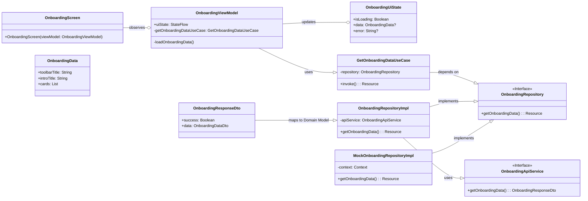

# JarMvpOnboarding

## Overview

JarMvpOnboarding is a sample Android application that demonstrates a modern onboarding experience using **Jetpack Compose** and advanced animation techniques. The app showcases a sequence of animated cards that expand and collapse to guide the user through the application's features.

The project is built with a **clean architecture** approach, separating concerns into data, domain, and presentation layers. It leverages modern Android development libraries and tools to create a scalable and maintainable codebase.

---

## 📐 Architecture Diagram

### Class Diagram

This diagram provides a detailed look at the primary classes and their relationships within the application's architecture.



---

## 📦 Builds and Releases

You can find the latest release APKs on the [**GitHub Releases**](https://github.com/harish1702/jarmvponboarding/releases) page.

### Latest Release

* **Version:** 1.0.0
* **Description:** Initial release of the JarMvpOnboarding application. Includes the full onboarding flow with animations and dynamic content.

---

## ✨ Features

* **Engaging Onboarding Flow:** A visually appealing and interactive onboarding experience with smooth animations.
* **Dynamic Content:** The onboarding content is fetched from a remote JSON file, allowing for easy updates without requiring an app update.
* **Clean Architecture:** The codebase is organized into data, domain, and presentation layers, promoting separation of concerns and testability.
* **Offline Support:** The app includes a mock repository that reads data from a local JSON file in the assets folder, enabling development and testing without a network connection.
* **Shared Element Transitions:** Utilizes the new `SharedTransitionLayout` API in Jetpack Compose for seamless transitions between collapsed and expanded card views.
* **Customizable Animations:** The animation sequence and timings are configurable through the remote JSON, providing flexibility to experiment with different animation effects.
* **Lottie Animation Integration:** Displays a Lottie animation on the final call-to-action button, enhancing the user experience.

---

## 🛠️ Technical Highlights & Libraries Used

This project demonstrates the use of several modern Android development libraries and concepts:

* **[Jetpack Compose](https://developer.android.com/jetpack/compose):** The UI is built entirely with Jetpack Compose, a declarative UI toolkit for building native Android apps.
* **[Shared Element Transitions API](https://developer.android.com/jetpack/compose/animation/shared-elements):** A new API in Jetpack Compose that simplifies the creation of shared element transitions between composables. In this project, `SharedTransitionLayout` is used to animate the transition of the image and text when a card is expanded or collapsed.
* **[Kotlin](https://kotlinlang.org/):** The project is written entirely in Kotlin, a modern, concise, and safe programming language.
* **[Coroutines](https://kotlinlang.org/docs/coroutines-overview.html):** Used for managing asynchronous operations, such as network requests and animations.
* **[StateFlow](https://developer.android.com/kotlin/flow/stateflow-and-sharedflow):** A state-holder observable flow that emits the current and new state updates to its collectors. It is used in the `OnboardingViewModel` to expose the UI state to the `OnboardingScreen`.
* **[ViewModel](https://developer.android.com/topic/libraries/architecture/viewmodel):** Part of the Android Architecture Components, the ViewModel is used to store and manage UI-related data in a lifecycle-conscious way.
* **[Coil](https://coil-kt.github.io/coil/):** An image loading library for Android backed by Kotlin Coroutines. It is used to load images from URLs into the `AsyncImage` composable.
* **[Retrofit](https://square.github.io/retrofit/):** A type-safe HTTP client for Android and Java. It is used to fetch the onboarding data from the remote server.
* **[Kotlinx Serialization](https://github.com/Kotlin/kotlinx.serialization):** A Kotlin multiplatform / multi-format serialization library. It is used to parse the JSON response from the server.
* **[Lottie](http://airbnb.io/lottie/):** A library for Android, iOS, Web, and Windows that parses Adobe After Effects animations exported as JSON and renders them natively on mobile and the web.
* **[Clean Architecture](https://blog.cleancoder.com/uncle-bob/2012/08/13/the-clean-architecture.html):** The project follows a clean architecture pattern, separating the code into three main layers:
    * **Data:** Contains the repository implementation, API service, and data transfer objects (DTOs).
    * **Domain:** Contains the business logic, use cases, and model classes.
    * **Presentation:** Contains the UI (Compose screens) and ViewModel.

---


## 🚀 Setup and Installation

### Option 1: Install the APK directly

If you don't want to build the project from the source, you can download and install the pre-built APK from the releases page.

### Option 2: Build from source

1.  **Clone the repository:**
    ```bash
    git clone [https://github.com/harish1702/jarmvponboarding.git](https://github.com/harish1702/jarmvponboarding.git)
    ```
2.  **Open in Android Studio:** Open the cloned project in Android Studio.
3.  **Build the project:** Android Studio will automatically download the required dependencies and build the project.
4.  **Run the app:** Run the app on an Android emulator or a physical device.

### Installation Steps

1.  **Clone the repository:**
    Open your terminal or command prompt and run the following command to clone the project to your local machine:
    ```bash
    git clone [https://github.com/harish123/jarmvponboarding.git](https://github.com/harish123/jarmvponboarding.git)
    ```

2.  **Open in Android Studio:**
    * Launch Android Studio.
    * Select **"Open an existing Project"** and navigate to the directory where you cloned the repository.
    * Select the `JarMvpOnboarding` folder and click **"Open"**.

3.  **Build the Project:**
    * Android Studio will automatically detect the Gradle configuration files (`build.gradle.kts`, `settings.gradle.kts`).
    * It will download the specified Gradle version (`gradle-8.13-bin.zip`) and all the required dependencies listed in `libs.versions.toml`.
    * This process, called "Gradle Sync," may take a few minutes. You can monitor its progress in the bottom status bar of Android Studio.

4.  **Run the App:**
    * Once the Gradle sync is complete and the project has been built successfully, you can run the application.
    * Select an Android emulator or connect a physical Android device.
    * Click the **"Run 'app'"** button (a green play icon) in the top toolbar of Android Studio.
    * The app will be installed and launched on your selected device/emulator. The main entry point is `MainActivity`.


    
